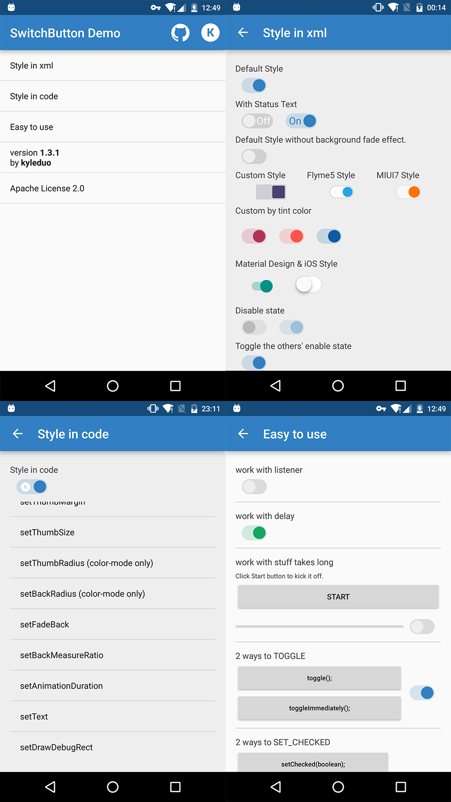

SwitchButton
============

[](https://android-arsenal.com/details/1/1119)

**To get a quick preview, you can get Demo apk in [Google Play](https://play.google.com/store/apps/details?id=com.kyleduo.switchbutton.demo) or [Directly download](./demo/switchbutton_demo_142.apk).**

This project provides you a convenient way to use and customise a SwitchButton widget in Android. With just resources changed and attrs set, you can create a lifelike SwitchButton of Android 5.0+, iOS, MIUI, or Flyme and so on.

Now we get the biggest movement since SwitchButton published. v1.3.0 comes with totally reconsitution and more convenient API. A wholly new demo can give you a tour in it.

***


Change Log
---

Latested Change Log:

> 1. Fixed [#75](https://github.com/kyleduo/SwitchButton/issues/75) [#78](https://github.com/kyleduo/SwitchButton/issues/78) [#85](https://github.com/kyleduo/SwitchButton/issues/85). 

[Change History.](https://github.com/kyleduo/SwitchButton/blob/master/CHANGELOG.md)


Using SwitchButton in your application
---
~~ADT~~

	No more support

__Gradle__
​	
Add dependencies in build.gradle of your module

	dependencies {
		compile 'com.kyleduo.switchbutton:library:1.4.5'
	}
***


Demo
---
I create a new demo apk to show you how to style the cute widget and use it. There's some screenshots of the new demo.



***


Usage
---

The usage of SwitchButton is just like CheckBox. The basic control APIs of SwitchButton.

* __setChecked(boolean)__
* __toggle()__

Since SwitchButton has addition animation when checked status changed, there are two addition methods for disable animation for single operation.

* __setCheckedImmediately(boolean)__: like setChecked but NO animation.
* __toggleImmediately()__: like toggle but NO animation.

From **version 1.4.1** on, SwitchButton support operation without onCheckedChanged callback. It makes changing state in code more convenient. Using these methods to achieve that feature.


* __setCheckedNoEvent(boolean)__
* __setCheckedImmediatelyNoEvent(boolean)__
* __toggleNoEvent()__
* __toggleImmediatelyNoEvent()__

***


Style
---

In 1.3.0, I updated the usage of __SwitchButton__ library. To make it more Android way to use, I've combined the thumb and back style each to StateListColor/StateListDrawable. So you are free to create styles in different states.

In __xml__ layout file, you can configure the face of switch button using these attrs.

*   __kswThumbDrawable__: drawable for thumb
*   __kswThumbColor__: color for thumb
*   __kswThumbMargin__: margin from thumb to back, can be negative. maybe cover by single direction margins
*   __kswThumbMarginTop__: same to __kswThumbMargin__, just top
*   __kswThumbMarginBottom__: same to __kswThumbMargin__, just bottom
*   __kswThumbMarginLeft__: same to __kswThumbMargin__, just left
*   __kswThumbMarginRight__: same to __kswThumbMargin__, just right
*   __kswThumbWidth__: width of thumb
*   __kswThumbHeight__: height of thumb
*   __kswThumbRadius__: radius of thumb rect, only work with __kswThumbColor__
*   __kswBackRadius__: radius of background rect, only work with __kswBackColor__
*   __kswBackDrawable__: drawable for background
*   __kswBackColor__: color for background
*   __kswFadeBack__: fade background color/drawable when drag or animate between on/off status or not
*   __kswBackMeasureRatio__: (background's width / thumb's width). float value.
*   __kswAnimationDuration__: duration of animation between 2 status
*   __kswTintColor__: change SwitchButton's style just by __one__ property, all relevant color will be generate automatically. Do not support `SwitchButtonMD` or other style created by xml resources.
*   __kswTextOn__: text for checked status.
*   __kswTextOff__: text for unchecked status.
*   __kswTextMarginH__: horizontal margin of text.
*   __kswAutoAdjustTextPosition__: **(Since 1.4.4)** whether auto adjust text position to make them looks centered (NOT really centered) when there are round corners. You should set this to false when you don't need this feature.

You can alse change the configuration of SwitchButton ___in code___. You can find the api from Demo apk. There's a glance.

```
private String[] opts = new String[]{
			"setThumbColorRes/setThumbColor",
			"setThumbDrawableRes/setThumbDrawable",
			"setBackColorRes/setBackColor",
			"setBackDrawableRes/setBackDrawable",
			"setTintColor",
			"setThumbMargin",
			"setThumbSize",
			"setThumbRadius (color-mode only)",
			"setBackRadius (color-mode only)",
			"setFadeBack",
			"setBackMeasureRatio",
			"setAnimationDuration",
			"setDrawDebugRect",
			"setText",
	};
```


Beautiful Apps
---

If you're using SwitchButton in your app, wish you can email me these infomation of your app and I'll create a list here. And that should be an utmost encouragement to me. :-) [kyleduo@gmail.com](mailto:kyleduo@gmail.com)

| App                                      | Name                    | Description                              | Markets                                  | Developer                                |
| ---------------------------------------- | ----------------------- | ---------------------------------------- | ---------------------------------------- | ---------------------------------------- |
|  | Headlines               | Headlines is a news dashboard for your smart TV. | [](https://play.google.com/store/apps/details?id=com.mystraldesign.headlines)[](https://www.amazon.com/Headlines-news-your-big-screen/dp/B01G93GRGC/ref=sr_1_1?ie=UTF8&qid=1487843182&sr=8-1&keywords=mystral+design) | [MYSTRAL](http://www.mystraldesign.com/) |
|  | 懒投资                     | 专业安全的投资理财平台                              | [官方网站](https://lantouzi.com/mobile/download) | [懒投资 lantouzi.com](https://lantouzi.com) |
|  | Notifications in bubble | Access all notifications from a floating bubble. | [](https://play.google.com/store/apps/details?id=com.ram.chocolate.nm.premium) | [BestAppzz](https://play.google.com/store/apps/developer?id=BestAppzz) |


License
---

	Licensed under the Apache License, Version 2.0 (the "License");
	you may not use this file except in compliance with the License.
	You may obtain a copy of the License at
	
	   http://www.apache.org/licenses/LICENSE-2.0
	
	Unless required by applicable law or agreed to in writing, software
	distributed under the License is distributed on an "AS IS" BASIS,
	WITHOUT WARRANTIES OR CONDITIONS OF ANY KIND, either express or implied.
	See the License for the specific language governing permissions and
	limitations under the License.
