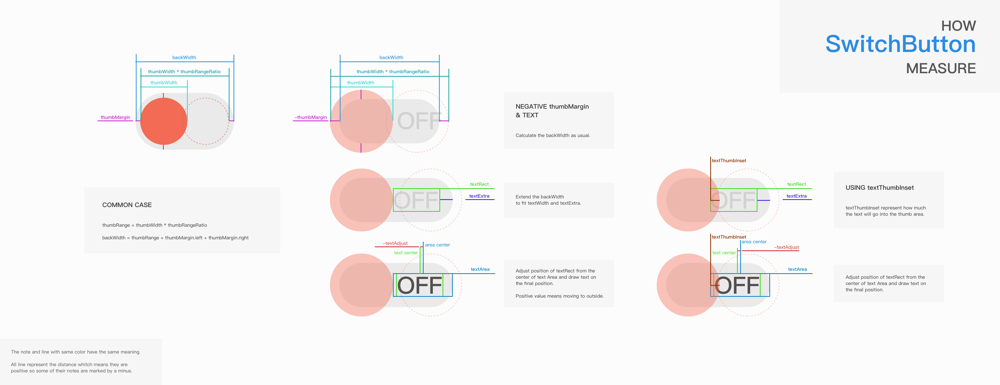
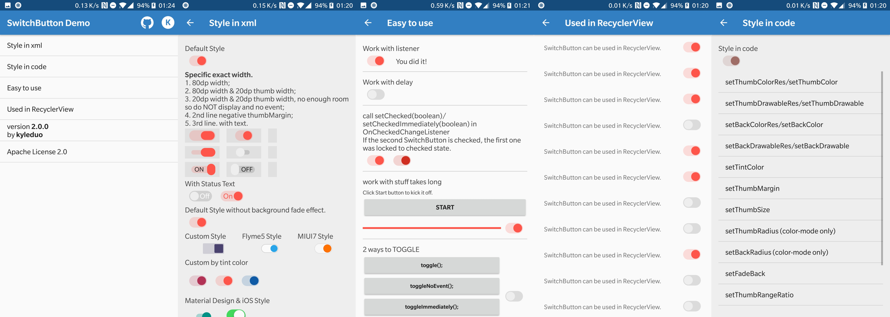

SwitchButton
============

[](https://android-arsenal.com/details/1/1119)

**To get a quick preview, you can get Demo apk in [Google Play](https://play.google.com/store/apps/details?id=com.kyleduo.switchbutton.demo) or [Directly download](./demo/switchbutton_demo_200.apk).**

This project provides you a convenient way to use and customise a SwitchButton widget in Android.

***


Change Log
---

[All Change Log](./CHANGELOG.md)

**Some attributes are changed in 2.0.0 and you need to update them to the new ones, since the measurement logic has been totally changed. (Default behavior and style does not change.)**

**因为2.0.0测量逻辑的改变，部分属性已经做了修改，请更新到新的属性。（默认行为和样式并没有变化）**

> 1.  Re-clarify the meaning of some params.
> 2.  Update the measurement of SwitchButton and the logic becomes more clear, especially the text part.
> 3.  Support config SwitchButton's size by setting a exact width and height. There are now TWO mainly method to control it's size.
> 4.  When use SwitchButon in a scrollable view, SwitchButton consume scroll gestures only horizontal. This means the when you want to scroll the scrollable view vertically and start your touch on a SwitchButton, it will not stop you now.
> 5.  Bug fix.

>1.  重新明确了参数的含义。
>2.  更新了SwitchButton的测量机制，逻辑更加清晰；尤其是文字部分。
>3.  支持设置确定的宽高，来确定SwitchButton的View大小。现在有两种方式可以控制SwitchButton的大小了。
>4.  可滚动的View中的SwitchButton只会消费横向滚动事件。这意味着你可以从SwitchButton开始按下并纵向滚动可滚动View，SwitchButton现在不会阻止你滚动了。
>5.  Bug 修复。


Using SwitchButton in your application
---

**In Gradle**
​	
Add dependencies in build.gradle of your module

```groovy
dependencies {
    implementation 'com.kyleduo.switchbutton:library:2.1.0'
}
```

> Version 2.1.0 can be pulled from `mavenCentral()`

#### Migrate to 2.0.0 (迁移到2.0.0)

**ENG**

**There is a big diagram below to show how SwitchButton measure it self in 2.0.0. It is strongly recommended that you should check it out.**

1.  **kswBackMeasureRatio** has been removed from SwitchButton attributes since it has an ambiguous meaning. I've add the new **kswThumbRangeRatio** attribute to represent how much multiple the scroll range of thumb than the width of thumb.
2.  **kswTextMarginH** and **kswAutoAdjustTextPosition** have been removed from SwitchButton attributes since I updated the measurement logic of text part. And these two attributes do not represent the back meaning well. **kswTextThumbInset**, **kswTextExtra** and **kswTextAdjust** was introduced to represent "how much the text go under thumb", "how much extra space do you want around the text" and "how much to move the text from the center of text area to adjust the text's position". There are all shown on the diagram.
3.  Setters and getters are also changed due to the change of attributes.

**CHN**

下面有一张图表来解释SwitchButton在2.0.0版本中是如何进行测量的，非常建议你看一看。

1.  **kswBackMeasureRatio** 属性被移除了，因为名称有歧义。新增加的 **kswThumbRangeRatio** 属性表示thumb移动区域和thumb宽度的比值。
2.  **kswTextMarginH** 和 **kswAutoAdjustTextPosition** 属性被移除了，因为我更新了对文字的测量逻辑，而且这两个属性名称表意不明确。我增加了**kswTextThumbInset**, **kswTextExtra** 和 **kswTextAdjust** 这三个新属性来分别表示“文字在thumb下面的距离”，“额外文字空间”和”文字调节距离“。这些都在图表中有所体现。
3.  setter和getter都跟随属性名称的改变而进行了改变。

### Diagram: How SwitchButton Measure

This diagram shows how SwitchButton measure itself and what does those nouns mean. To measure width is much complex than the height, so if you know how to measure width, you know how to measure height. And text measurement and location increase the complexity.



***


Demo
---
I create a new demo apk to show you how to style the cute widget and use it. There's some screenshots of the new demo.



***


Usage
---

The usage of SwitchButton is just like CheckBox. The basic control APIs of SwitchButton.

* __setChecked(boolean)__
* __toggle()__

Since SwitchButton has addition animation when checked status changed, there are two addition methods for disable animation for single operation.

* __setCheckedImmediately(boolean)__: like setChecked but NO animation.
* __toggleImmediately()__: like toggle but NO animation.

From **version 1.4.1** on, SwitchButton support operation without onCheckedChanged callback. It makes changing state in code more convenient. Using these methods to achieve that feature.


* __setCheckedNoEvent(boolean)__
* __setCheckedImmediatelyNoEvent(boolean)__
* __toggleNoEvent()__
* __toggleImmediatelyNoEvent()__

***


Style
---

In 1.3.0, I updated the usage of __SwitchButton__ library. To make it more Android way to use, I've combined the thumb and back style each to StateListColor/StateListDrawable. So you are free to create styles in different states.

In __xml__ layout file, you can configure the face of switch button using these attrs.

*   __kswThumbDrawable__: drawable for thumb
*   __kswThumbColor__: color for thumb
*   __kswThumbMargin__: margin from thumb to back, can be negative. maybe cover by single direction margins
*   __kswThumbMarginTop__: same to __kswThumbMargin__, just top
*   __kswThumbMarginBottom__: same to __kswThumbMargin__, just bottom
*   __kswThumbMarginLeft__: same to __kswThumbMargin__, just left
*   __kswThumbMarginRight__: same to __kswThumbMargin__, just right
*   __kswThumbWidth__: width of thumb
*   __kswThumbHeight__: height of thumb
*   __kswThumbRadius__: radius of thumb rect, only work with __kswThumbColor__
*   __kswBackRadius__: radius of background rect, only work with __kswBackColor__
*   __kswBackDrawable__: drawable for background
*   __kswBackColor__: color for background
*   __kswFadeBack__: fade background color/drawable when drag or animate between on/off status or not
*   __kswAnimationDuration__: duration of animation between 2 status
*   __kswTintColor__: change SwitchButton's style just by __one__ property, all relevant color will be generate automatically. Do not support `SwitchButtonMD` or other style created by xml resources.
*   __kswTextOn__: text for checked status.
*   __kswTextOff__: text for unchecked status.
*   __kswTextThumbInset (since 2.0.0)__: length of the part of text under the thumb.
*   __kswTextExtra (since 2.0.0)__: extra space needed by background besides the actual text width.
*   __kswTextAdjust (since 2.0.0)__: move the text after position text on the center of text area.
*   **kswThumbRangeRatio (since 2.0.0)**: (thumb move range width / thumb's width). float value. *see measure diagram*
*   ~~__kswBackMeasureRatio__: (background's width / thumb's width). float value.~~ *Removed since 2.0.0*
*   ~~**kswTextMarginH**: horizontal margin of text.~~ *Removed since 2.0.0*
*   ~~__kswAutoAdjustTextPosition__: **(since 1.4.4)** whether auto adjust text position to make them looks centered (NOT really centered) when there are round corners. You should set this to false when you don't need this feature.~~ *Removed since 2.0.0*

You can alse change the configuration of SwitchButton ___in code___. You can find the api from Demo apk. There's a glance.

```java
private String[] opts = new String[]{
			"setThumbColorRes/setThumbColor",
			"setThumbDrawableRes/setThumbDrawable",
			"setBackColorRes/setBackColor",
			"setBackDrawableRes/setBackDrawable",
			"setTintColor",
			"setThumbMargin",
			"setThumbSize",
			"setThumbRadius (color-mode only)",
			"setBackRadius (color-mode only)",
			"setFadeBack",
			"setBackMeasureRatio",
			"setAnimationDuration",
			"setDrawDebugRect",
			"setText",
	};
```


Beautiful Apps
---

If you're using SwitchButton in your app, wish you can email me these infomation of your app and I'll create a list here. And that should be an utmost encouragement to me. :-) [kyleduo@gmail.com](mailto:kyleduo@gmail.com)

| App                                      | Name                    | Description                              | Markets                                  | Developer                                |
| ---------------------------------------- | ----------------------- | ---------------------------------------- | ---------------------------------------- | ---------------------------------------- |
|  | Headlines               | Headlines is a news dashboard for your smart TV. | [](https://play.google.com/store/apps/details?id=com.mystraldesign.headlines)[](https://www.amazon.com/Headlines-news-your-big-screen/dp/B01G93GRGC/ref=sr_1_1?ie=UTF8&qid=1487843182&sr=8-1&keywords=mystral+design) | [MYSTRAL](http://www.mystraldesign.com/) |
|  | 懒投资                     | 专业安全的投资理财平台                              | [官方网站](https://lantouzi.com/mobile/download) | [懒投资 lantouzi.com](https://lantouzi.com) |
|  | Notifications in bubble | Access all notifications from a floating bubble. | [](https://play.google.com/store/apps/details?id=com.ram.chocolate.nm.premium) | [BestAppzz](https://play.google.com/store/apps/developer?id=BestAppzz) |


License
---

	Licensed under the Apache License, Version 2.0 (the "License");
	you may not use this file except in compliance with the License.
	You may obtain a copy of the License at
	
	   http://www.apache.org/licenses/LICENSE-2.0
	
	Unless required by applicable law or agreed to in writing, software
	distributed under the License is distributed on an "AS IS" BASIS,
	WITHOUT WARRANTIES OR CONDITIONS OF ANY KIND, either express or implied.
	See the License for the specific language governing permissions and
	limitations under the License.
